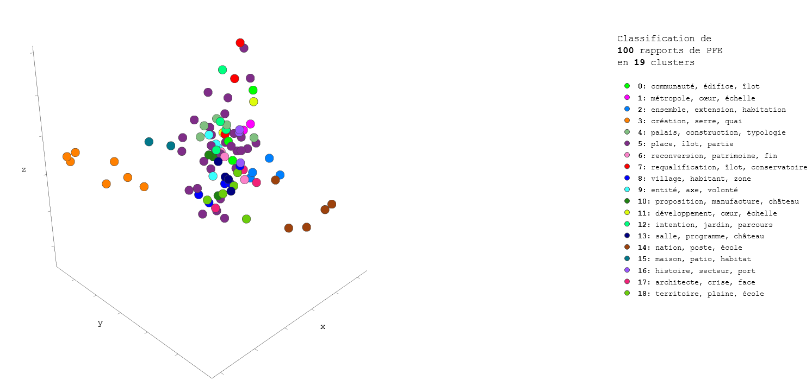

# Carte sémantique des PFE d'ArchiRès

*Dernière màj le 01/11/2021*

Carte sémantique de projets de fin d'études en architecture, dont les données sont issues de la plateforme [ArchiRès](https://www.archires.archi.fr/), extraites grâce à [ArchiRèsParser](https://github.com/VincDub/ArchiResParser).

